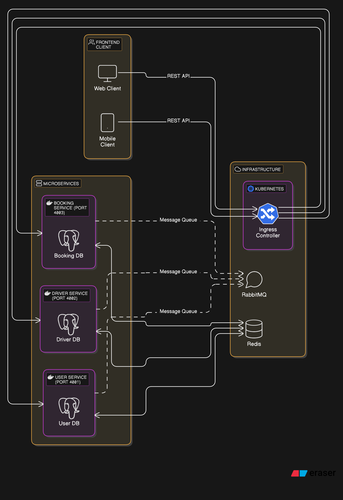

# Cab Service Microservices Application

A modern microservices-based cab booking application built with Node.js, Express, and containerized using Docker with Kubernetes deployment capability.

## Project Overview

This project implements a ride-hailing service with three main microservices:
- **User Service**: Manages user accounts and authentication
- **Driver Service**: Handles driver profiles and availability
- **Booking Service**: Processes ride bookings and status updates

## Architecture



### Technology Stack
- **Backend**: Node.js with Express
- **Database**: PostgreSQL
- **Caching**: Redis
- **Messaging**: RabbitMQ
- **Containerization**: Docker
- **Orchestration**: Kubernetes

## Services

### User Service (Port 4001)
Manages user accounts and authentication.
- Create user accounts
- Retrieve user information
- Health check endpoints

### Driver Service (Port 4002)
Handles driver profiles and availability.
- Create driver profiles
- Set driver availability
- List available drivers
- Health check endpoints

### Booking Service (Port 4003)
Processes ride bookings and status updates.
- Request rides
- Assign drivers to rides
- Complete rides
- Get ride information
- Health check endpoints

## Running the Application

### Prerequisites
- Docker and Docker Compose
- Kubernetes cluster (minikube for local development) (optional, for k8s deployment)
- Node.js (optional, for local development)

### Using Docker Compose

1. Clone the repository
2. Start the application:
   ```bash
   npm run dev
   # or
   docker compose up -d
   ```
3. To stop the application:
   ```bash
   npm run stop
   # or
   docker compose down
   ```

### Using Kubernetes

1. Build the Docker images:
   ```bash
   npm run build
   ```

2. Deploy to Kubernetes:
   ```bash
   npm run k8s
   # or
   kubectl apply -R -f k8s/
   ```

3. To clean up Kubernetes resources:
   ```bash
   npm run k8s-delete
   # or
   kubectl delete -R -f k8s/
   ```

## API Endpoints

### User Service
- `POST /users` - Create a new user
- `GET /users/:id` - Get user details
- `GET /users/health` - Health check

### Driver Service
- `POST /drivers` - Create a new driver
- `POST /drivers/:id/availability` - Set driver availability
- `GET /drivers/available` - List available drivers
- `GET /drivers/health` - Health check

### Booking Service
- `POST /rides` - Request a new ride
- `POST /rides/:id/assign` - Assign a driver to a ride
- `POST /rides/:id/complete` - Complete a ride
- `GET /rides/:id` - Get ride details
- `GET /rides/health` - Health check

## Development

### Project Structure
```
.
├── booking-service/        # Booking service 
├── db-init/                # Database initialization scripts
├── docker-compose.yml      # Docker Compose configuration
├── driver-service/         # Driver service
├── k8s/                    # Kubernetes manifests
├── package.json            # Root package with workspace settings
└── user-service/           # User service
```

### Local Development

To run individual services locally:

1. Install dependencies:
   ```bash
   pnpm install
   ```

2. Run a specific service:
   ```bash
   cd user-service
   node index.js
   ```

## Kubernetes Architecture

The application is deployed to Kubernetes with:
- Separate deployments for each service
- Service discovery
- Ingress for routing external traffic
- Health checks for reliable operation
- Resource limits for proper scaling
